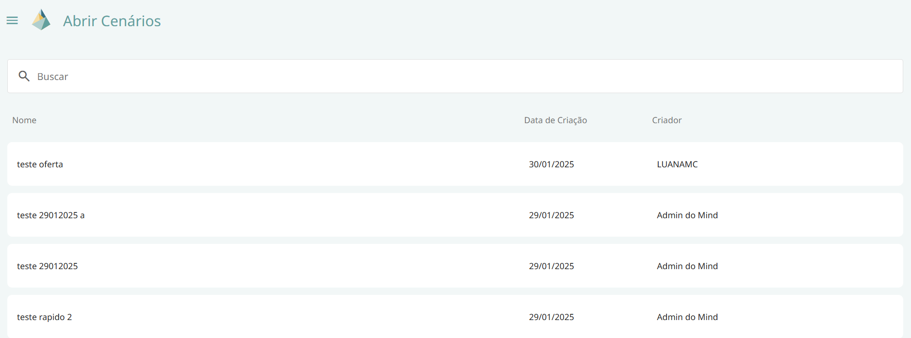
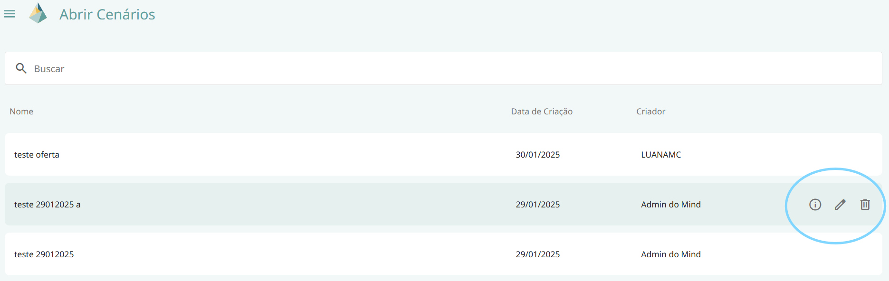

# Abrir Cenário

Esta tela permite visualizar a **lista de cenários** criados pelo usuário, bem como aqueles aos quais ele tem acesso.  

Para abrir um cenário, basta **clicar sobre a linha correspondente**.  

## Funcionalidades

### Visualizar Cenário
Permite acessar informações detalhadas sobre o cenário.  

### Excluir
Permite excluir um cenário. Apenas o usuário criador pode realizar essa ação.  

### Editar
Permite modificar o **nome** e a **descrição** do cenário. Apenas o usuário criador pode realizar essa ação.  

### Duplicar
Permite criar uma cópia do cenário selecionado.  

