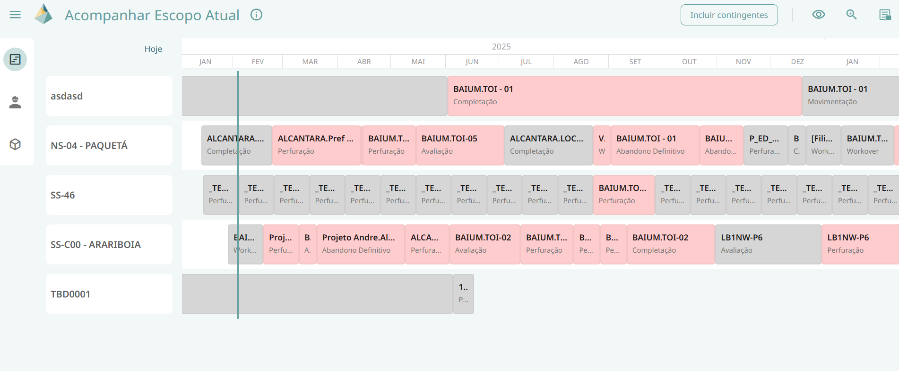

# Acessar Escopo Atual

Permite o usuário visualizar o filme do CW Recursos, com o atendimento calculado por ID recurso de materiais para demanda firme e
demanda total (Firme+Contingente).

Vale ressaltar, que diferente do simulador de cenários, a funcionalidade de acessar escopo atual é um Gantt não editável.

A funcionalidade de acessar escopo atual também conta com uma aba lateral que contém 3 ícones: cronograma (onde se encontram as sondas e as tarefas com suas determinadas cores), painel de materiais e painel de serviços. 

## Integrações

- Demanda: CW Recursos (Escopo atual)

- Identificar centro supridor: WS (Centro)

- Oferta: CROSS (Saldo Id Recurso)

## Funcionalidades

As funções do cronograma se concentram na parte superior direita da tela, são elas:

### Informação
Apresenta ao usuário informações referentes ao cache como “descrição”, “atualizado em”, “oferta de materiais atualizada em” e “disponibilidade de serviços atualizada em” com relação ao escopo atual.

### Botão incluir contingentes
Permite ao usuário escolher incluir ou não os recursos contingentes. Sendo recurso contingente um recurso que pode ser utilizado caso o original não esteja disponível para uso.

### Visualizar atendimentos
Permite ao usuário escolher entre as opções de visualizar todos os recursos, todos os materiais, todos os serviços ou selecionar apenas recursos de seu interesse. Caso essa última opção seja selecionada, um pop up será aberto na tela para que o usuário selecione os recursos desejados. Vale ressaltar que ao escolher selecionar todos os materiais, aparecerá acima do ícone de visualizar atendimento um badge com a letra M, caso seja selecionada a opção de todos os serviços o badge aparecerá com a letra S e caso o usuário escolha a opção de selecionar apenas recursos de seu interesse o badge contará com a quantidade de recursos selecionados. Caso a opção de todos os recursos seja escolhida, o ícone não apresentará nenhum badge.

### Zoom
Aumenta ou diminui o horizonte visualizado na tela do cronograma.

### Resumo
Abre uma aba lateral de resumo na qual temos as informações da quantidade total de tarefas, e quantidade e percentual de tarefas atendidas, não atendidas e não calculadas. Além disso, essa aba também funciona como um tipo de filtro, no qual as tarefas que não estão selecionadas ficam esmaecidas.
