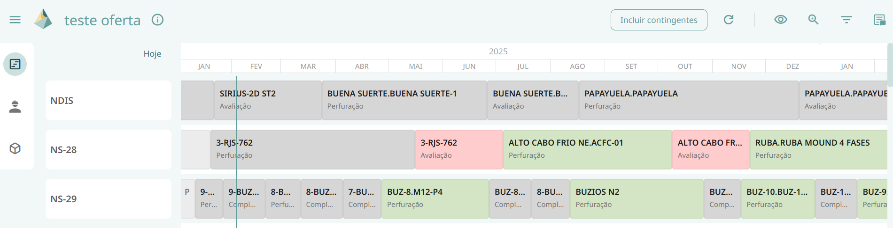

# Gantt do Cenário

Ao abrir um cenário irá abrir um cronograma no Gantt, com os dados referentes a fonte escolhida pelo criador na tela de gerar cenário (escopo atual ou última publicação de escopo), neste cronograma é possível observar que as caixas que representam tarefas são representadas pelas seguintes cores:

- Cinza- Não calculado

- Vermelho- Não atende

- Verde – Atende 

Essas cores representam o atendimento da tarefa em relação aos recursos selecionados no cronograma, considerando sempre o pior caso. 

Essa seleção de recursos é feita através da função de Visualizar Atendimento que permite ao usuário selecionar subconjuntos de recursos de interesse para análise, refletindo, portanto, na cor da tarefa.

Uma tarefa é composta por atividades, se ao menos uma atividade não consegue ser atendida então toda a tarefa é classificada como não atende.

Além disso, essas tarefas estão distribuídas em diferentes linhas, em que cada uma das linhas corresponde a uma determinada sonda, cujo nome se encontra do lado esquerda da tela.

A tela dos cenários também conta com uma aba lateral que contém 3 ícones: cronograma (onde se encontram as sondas e as tarefas com suas determinadas cores), painel de materiais e painel de serviços. Cada um desses painéis será descrito mais detalhadamente em seguida.

## Aba Lateral

Ao clicar em uma tarefa, abrirá uma aba lateral com diversas informações de identificação sobre a tarefa em questão além das informações de atendimento a respeito de cada atividade que compõe aquela tarefa.

## Funcionalidades

Além da visualização do cronograma e das cores referentes a cada tarefa, esta tela também possui as seguintes funcionalidades:

### Informação
 Apresenta ao usuário informações referentes ao cache como “descrição”, “atualizado em”, “oferta de materiais atualizada em” e “disponibilidade de serviços atualizada em” com relação ao escopo atual.

### Botão incluir contingentes
 Permite ao usuário escolher incluir ou não os recursos contingentes. Sendo recurso contingente um recurso que pode ser utilizado caso o original não esteja disponível para uso.

### Visualizar atendimentos
Permite ao usuário escolher entre as opções de visualizar todos os recursos, todos os materiais, todos os serviços ou selecionar apenas recursos de seu interesse. Caso essa última opção seja selecionada, um pop up será aberto na tela para que o usuário selecione os recursos desejados. Vale ressaltar que ao escolher selecionar todos os materiais, aparecerá acima do ícone de visualizar atendimento um badge com a letra M, caso seja selecionada a opção de todos os serviços o badge aparecerá com a letra S e caso o usuário escolha a opção de selecionar apenas recursos de seu interesse o badge contará com a quantidade de recursos selecionados. Caso a opção de todos os recursos seja escolhida, o ícone não apresentará nenhum badge.

### Zoom
 Aumenta ou diminui o horizonte visualizado na tela do cronograma.

### Resumo
 Abre uma aba lateral de resumo na qual temos as informações da quantidade total de tarefas, e quantidade e percentual de tarefas atendidas, não atendidas e não calculadas. Além disso, essa aba também funciona como um tipo de filtro, no qual as tarefas que não estão selecionadas ficam esmaecidas.

### Filtro
 Permite ao usuário filtrar as tarefas por cluster, bacia, projeto, tipo de serviço, tipo de tarefa e atendimento padrão. Vale ressaltar que podem ser selecionadas mais de uma opção nesses filtros e os filtros podem ser sobrepostos.

Vale ressaltar ainda que, nesta tela o criador do cenário terá a possibilidade de movimentar as tarefas para diferentes datas e recalcular as classificações dessas tarefas através do botão de recálculo que se localiza do lado direito do botão de incluir contingentes. Este ícone terá junto dele um badge sempre que alguma modificação for feita no cenário indicando que é necessário recalcular novamente para obter as classificações atualizadas das tarefas.

