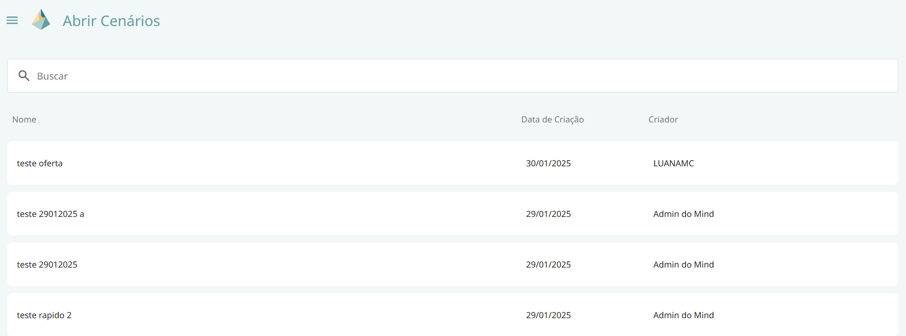
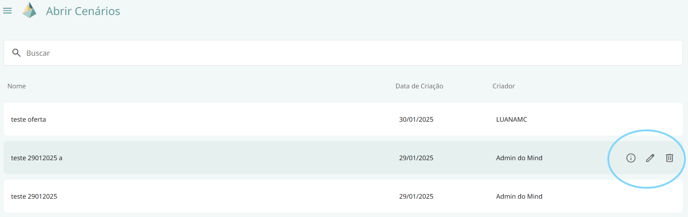
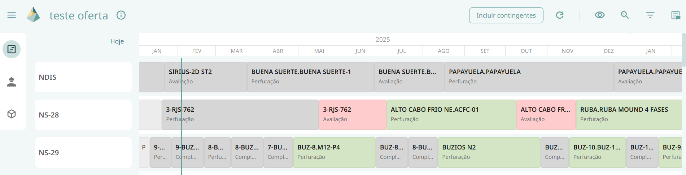

# Bem-Vindo ao guia de utilização do Prisma

##	Página inicial do Prisma
O usuário poderá escolher entre as três opções de fluxo de trabalho disponíveis na página inicial, sendo duas delas referentes ao simulador de cenários e outro referente ao escopo atual.

### Simulador de Cenários

#### Gerar Cenário
Ao clicar em gerar cenário, o usuário escolherá entre as opções de criar um cenário a partir dos dados da última publicação de escopo, que é uma foto atualizada quinzenalmente, ou do escopo atual que é um filme atualizado diariamente, cuja fonte de integração é o Cronoweb Recursos. 

Um cenário seria um cronograma referente a última atualização da fonte escolhida na tela de gerar cenário, que permite ao usuário visualizar todas as tarefas que estão sendo executadas a partir de hoje.  

Nesta tela, temos ainda as informações dos dados do cenário, que são: origem, data de criação, criado por e fonte.

Além disso, terá um espaço disponível para que o usuário escolha o nome do cenário (sendo essa uma informação obrigatória), a descrição do cenário (informação opcional), a data de criação (data na qual o usuário está gerando o cenário) e o horizonte, que por padrão estará em 24 meses, mas poderá ser alterado pelo usuário.

####	Abrir Cenário
Ao clicar em abrir cenário, o usuário terá acesso a uma lista de cenários já criados, com o nome do cenário, data de criação e criador.

Ao passar o mouse por cima de um dos cenários, o usuário poderá clicar nas seguintes opções:

- Visualizar cenário: nesta opção o usuário terá acesso a mais informações a respeito do cenário selecionado como descrição, origem, fonte, data de início e horizonte.

Caso o usuário seja o criador do cenário ele também poderá selecionar os ícones de:

- Excluir cenário

- Editar cenário: nesta opção o usuário poderá editar apenas o nome e a descrição do seu próprio cenário.

Ao clicar em qualquer um dos cenários irá abrir um cronograma, com os dados referentes a fonte escolhida pelo criador na tela de gerar cenário (escopo atual ou última publicação de escopo), neste cronograma é possível observar que as caixas que representam tarefas são representadas pelas seguintes cores:

- Cinza- Não calculado

- Vermelho- Não atende

- Verde – Atende 

Essas cores representam o atendimento da tarefa em relação aos recursos selecionados no cronograma, considerando sempre o pior caso. 

Essa seleção de recursos é feita através da função de Visualizar Atendimento que permite ao usuário selecionar subconjuntos de recursos de interesse para análise, refletindo, portanto, na cor da tarefa.

Uma tarefa é composta por atividades, se ao menos uma atividade não consegue ser atendida então toda a tarefa é classificada como não atende.

Além disso, essas tarefas estão distribuídas em diferentes linhas, em que cada uma das linhas corresponde a uma determinada sonda, cujo nome se encontra do lado esquerda da tela.

A tela dos cenários também conta com uma aba lateral que contém 3 ícones: cronograma (onde se encontram as sondas e as tarefas com suas determinadas cores), painel de materiais e painel de serviços. Cada um desses painéis será descrito mais detalhadamente em seguida.

Além da visualização do cronograma e das cores referentes a cada tarefa, esta tela também possui as seguintes funcionalidades:

- Informação: essa funcionalidade apresenta ao usuário informações referentes ao cache como “descrição”, “atualizado em”, “oferta de materiais atualizada em” e “disponibilidade de serviços atualizada em” com relação ao escopo atual.

- Botão incluir contingentes: essa funcionalidade permite ao usuário escolher incluir ou não os recursos contingentes. Sendo recurso contingente um recurso que pode ser utilizado caso o original não esteja disponível para uso.

- Visualizar atendimentos:  essa funcionalidade permite ao usuário escolher entre as opções de visualizar todos os recursos, todos os materiais, todos os serviços ou selecionar apenas recursos de seu interesse. Caso essa última opção seja selecionada, um pop up será aberto na tela para que o usuário selecione os recursos desejados. Vale ressaltar que ao escolher selecionar todos os materiais, aparecerá acima do ícone de visualizar atendimento um badge com a letra M, caso seja selecionada a opção de todos os serviços o badge aparecerá com a letra S e caso o usuário escolha a opção de selecionar apenas recursos de seu interesse o badge contará com a quantidade de recursos selecionados. Caso a opção de todos os recursos seja escolhida, o ícone não apresentará nenhum badge.

- Zoom:  essa funcionalidade aumenta ou diminui o horizonte visualizado na tela do cronograma.

- Resumo: essa funcionalidade abre uma aba lateral de resumo na qual temos as informações da quantidade total de tarefas, e quantidade e percentual de tarefas atendidas, não atendidas e não calculadas. Além disso, essa aba também funciona como um tipo de filtro, no qual as tarefas que não estão selecionadas ficam esmaecidas.

- Filtro: funcionalidade que permite ao usuário filtrar as tarefas por cluster, bacia, projeto, tipo de serviço, tipo de tarefa e atendimento padrão. Vale ressaltar que podem ser selecionadas mais de uma opção nesses filtros e os filtros podem ser sobrepostos.
Vale ressaltar ainda que, nesta tela o criador do cenário terá a possibilidade de movimentar as tarefas para diferentes datas e recalcular as classificações dessas tarefas através do botão de recálculo que se localiza do lado direito do botão de incluir contingentes. Este ícone terá junto dele um badge sempre que alguma modificação for feita no cenário indicando que é necessário recalcular novamente para obter as classificações atualizadas das tarefas.

##### Painel de Materiais
Ao selecionar a opção do painel de materiais, irá abrir um pop up na tela para que o usuário escolha os materiais de interesse.

Ao selecioná-los e clicar em “aplicar”, abrirá uma tela dividida em demanda e oferta, ao lado desses títulos temos a fonte de cada um deles, de onde são tiradas as informações. 

No card de demanda temos as colunas PG, Tipo Tarefa, Sonda, ID Recurso, atividade, data de necessidade, quantidade demandada, contingente e status.

Enquanto no card de oferta temos as informações de estoque, pedido e contrato.

Este painel é essencial para que o usuário consiga identificar as demandas e ofertas dos materiais de seu interesse, entendendo as ofertas disponíveis para este material e o motivo de algumas demandas referentes a ele não serem atendidas.

##### Painel de Serviços
Ao selecionar a opção do painel de serviços, irá abrir um pop up na tela para que o usuário escolha os serviços de interesse.

Ao selecioná-los e aplicar, abrirá uma tela dividida em demanda e oferta, ao lado desses títulos temos a fonte de cada um deles, de onde são tiradas as informações. 

No card de demanda temos as colunas PG, Atendimento padrão, Tipo Tarefa, Sonda, atividade, período de necessidade, quantidade demandada, contingente e status.

Enquanto no card de oferta temos as colunas data início, data fim, atendimento padrão e quantidade disponível.

Este painel é essencial para que o usuário consiga identificar as demandas e ofertas dos serviços de seu interesse, entendendo as ofertas disponíveis para esse serviço e o motivo de algumas demandas referentes a ele não serem atendidas.

### Acessar escopo atual 
O cronograma do escopo atual é o filme que é atualizado diariamente, cuja fonte de integração é o Cronoweb Recursos. 

A funcionalidade de acessar escopo atual também conta com uma aba lateral que contém 3 ícones: cronograma (onde se encontram as sondas e as tarefas com suas determinadas cores), painel de materiais e painel de serviços. 

As funções do cronograma se concentram na parte superior direita da tela, são elas:

- Informação: essa funcionalidade apresenta ao usuário informações referentes ao cache como “descrição”, “atualizado em”, “oferta de materiais atualizada em” e “disponibilidade de serviços atualizada em” com relação ao escopo atual.

- Botão incluir contingentes: essa funcionalidade permite ao usuário escolher incluir ou não os recursos contingentes. Sendo recurso contingente um recurso que pode ser utilizado caso o original não esteja disponível para uso.

- Visualizar atendimentos:  essa funcionalidade permite ao usuário escolher entre as opções de visualizar todos os recursos, todos os materiais, todos os serviços ou selecionar apenas recursos de seu interesse. Caso essa última opção seja selecionada, um pop up será aberto na tela para que o usuário selecione os recursos desejados. Vale ressaltar que ao escolher selecionar todos os materiais, aparecerá acima do ícone de visualizar atendimento um badge com a letra M, caso seja selecionada a opção de todos os serviços o badge aparecerá com a letra S e caso o usuário escolha a opção de selecionar apenas recursos de seu interesse o badge contará com a quantidade de recursos selecionados. Caso a opção de todos os recursos seja escolhida, o ícone não apresentará nenhum badge.

- Zoom:  essa funcionalidade aumenta ou diminui o horizonte visualizado na tela do cronograma.

- Resumo: essa funcionalidade abre uma aba lateral de resumo na qual temos as informações da quantidade total de tarefas, e quantidade e percentual de tarefas atendidas, não atendidas e não calculadas. Além disso, essa aba também funciona como um tipo de filtro, no qual as tarefas que não estão selecionadas ficam esmaecidas.

Além das opções de simular cenários e acessar escopo atual o usuário também poderá escolher na página inicial do Prisma entre as seguintes opções de painéis estáticos:

### Painel de publicações 
No painel de publicações o usuário pode acompanhar o status das publicações, nesse painel ele tem acesso a data e horário da última atualização referente ao planejamento sondas e planejamento de recursos, a fonte desses dados e a data em que foi publicado o cronograma oficial de planejamento para o primeiro deles e as datas referentes ao longo prazo, operacional e à publicação para o segundo deles.

Além disso, o usuário também tem acesso a data e horário da última atualização referente a resposta de prontidão e um resumo da prontidão, mostrando a quantidade de tarefas que se encontram em cada uma das classificações disponíveis: aguardando apontamento de recursos, analisando alternativas, pendente, não atende, atende, atende com ressalvas e não se aplica.

### Visão operacional
Nesta aba o usuário poderá acompanhar a prontidão através de um cronograma similar ao cronograma encontrado em escopo atual, a diferença é que aqui, temos mais classificações, não se limitando apenas a atende, não atende e calculado, neste cronograma uma tarefa pode ser classificada em: aguardando apontamento de recursos, analisando alternativas, pendente, não atende, atende, atende com ressalvas e não se aplica. Sendo cada uma dessas alternativas representada por uma cor no cronograma. Ao passar o mouse em cima da tarefa é possível visualizar no tooltip a classificação correspondente a cor da tarefa de interesse.

Este cronograma possui as seguintes funcionalidades:

- Zoom:  essa funcionalidade aumenta ou diminui o horizonte visualizado na tela do cronograma.

- Resumo: essa funcionalidade abre uma aba lateral de resumo na qual temos as informações da quantidade total de tarefas, e quantidade e percentual de tarefas atendidas, não atendidas e não calculadas. Além disso, essa aba também funciona como um tipo de filtro, no qual as tarefas que não estão selecionadas ficam esmaecidas.

- Filtro: funcionalidade que permite ao usuário filtrar as tarefas por cluster, bacia, projeto, tipo de serviço, tipo de tarefa e atendimento padrão. Vale ressaltar que podem ser selecionadas mais de uma opção nesses filtros e os filtros podem ser sobrepostos.

- Tarefas consideradas no atendimento: funcionalidade que permite ao usuário selecionar as opções de considerar tarefa, recurso ou grupo específico.

Nesta tela as diferenças que valem ressaltar quando comparadas as telas já citadas, é que aqui não temos painel de materiais e serviços na aba lateral à esquerda, temos apenas a opção de cronograma. 

Além disso, nesta tela também temos um botão onde o usuário escolhe entre resposta e recomendação, que muda a disposição do cronograma, porém o botão de recomendação só estará disponível para usuários administradores.

### Visão médio-prazo
Na aba visão médio-prazo o usuário poderá acompanhar atendimento das frentes de serviço, esta aba constitui uma grande tabela com as colunas: atendimento padrão, nome da premissa, recurso, frentes atuais e o percentual de atendimento do ano corrente mais o percentual de atendimento dos dois anos seguintes, por exemplo percentual de atendimento 2025, percentual de atendimento 2026 e percentual de atendimento 2027.

Frentes Atuais é a quantidade de serviços que temos disponíveis no momento para utilizarmos no Atendimento (esse dado vem da Disponibilidade da Árvore de Recursos). Enquanto frentes máximas é a quantidade máxima que temos em contrato para utilizarmos.

Esse painel de visão médio prazo tem como objetivo exibir o percentual anual de atendimento (e posteriormente capacidade) de cada frente de serviço. Esse painel é uma visão a médio prazo do Atendimento porque utilizamos o dado da demanda diária determinística calculada pelo DELFOS para fazer o cálculo do atendimento. 

Esse cálculo de atendimento do painel é feito avaliando quantos dias nós temos em que a quantidade de Frentes Máximas é menor do que a Demanda, dividido pelo total de dias do planejamento (como está por ano seria 365), o cálculo é feito então com 1 - esse valor pra pegar a porcentagem.

Vale ressaltar ainda que, no canto superior direito dessa tela o usuário também tem o botão de incluir contingentes, caso ele deseje visualizar a tabela com as atividades e recursos contingentes.

### Visão contratual
Esta aba poderá ser usada pelo usuário para acompanhar a contratação. Nela é possível visualizar um cronograma semelhante aos já tratados anteriormente, porém, ao invés de tarefas agora temos os contratos. 

Vale ressaltar ainda que, onde tinham sondas nos demais cronogramas, do lado esquerdo da tela, para separar as tarefas de forma que cada linha representava uma sonda e as tarefas atreladas a ela. Neste cronograma no lugar de sondas temos bens e serviços, com a mesma disposição, onde cada linha representa um bem/serviço e os contratos atrelados a ele.

Esta tela possui as seguintes funcionalidades:

- Zoom:  essa funcionalidade aumenta ou diminui o horizonte visualizado na tela do cronograma.

- Ocultar do painel: essa funcionalidade permite ao usuário escolher entre duas opções: ocultar do painel contrato vigente de bens ou contrato vigente de serviços.

- Legenda: essa funcionalidade abre um pop up com todas as cores representadas no cronograma e o que cada uma delas representa, tendo as possíveis classificações disponíveis: atendimento contratado, atendimento planejado de novo contrato, atendimento planejado de aditivo de valor ou prazo, atendimento planejado de mão de obra ou estoque Petrobras, atendimento planejado de alternativas técnicas, período sem demanda, indicação de período sem cobertura contratual para demandas continuadas, período sem atendimento no horizonte da vigência do contrato, período com atendimento fora da vigência do contrato e término da vigência do contrato.

