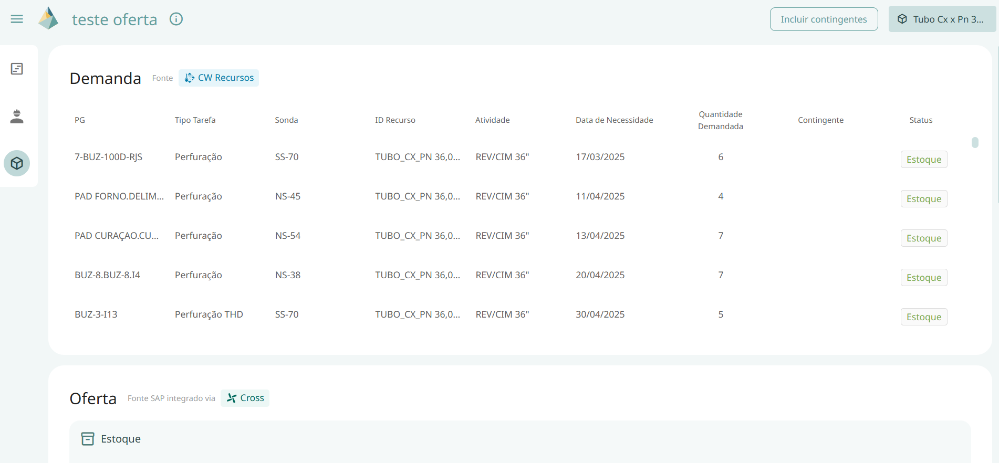
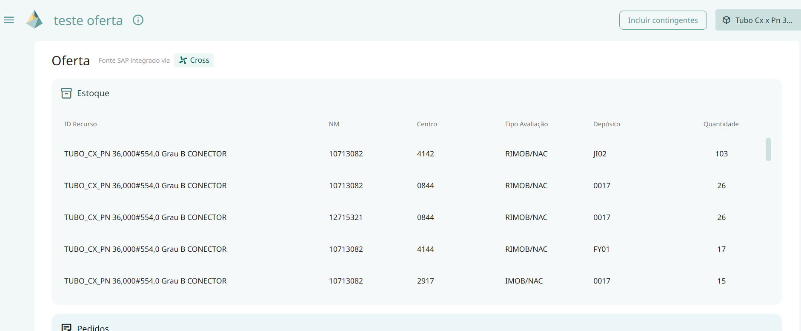

# Painel de Materiais

Ao selecionar a opção do painel de materiais, irá abrir um pop up na tela para que o usuário escolha os materiais de interesse.

Ao selecioná-los e clicar em “aplicar”, abrirá uma tela dividida em demanda e oferta, ao lado desses títulos temos a fonte de cada um deles, de onde são tiradas as informações. 

No card de demanda temos as colunas PG, Tipo Tarefa, Sonda, ID Recurso, atividade, data de necessidade, quantidade demandada, contingente e status.

Enquanto no card de oferta temos as informações de estoque, pedido e contrato.

Este painel é essencial para que o usuário consiga identificar as demandas e ofertas dos materiais de seu interesse, entendendo as ofertas disponíveis para este material e o motivo de algumas demandas referentes a ele não serem atendidas.

