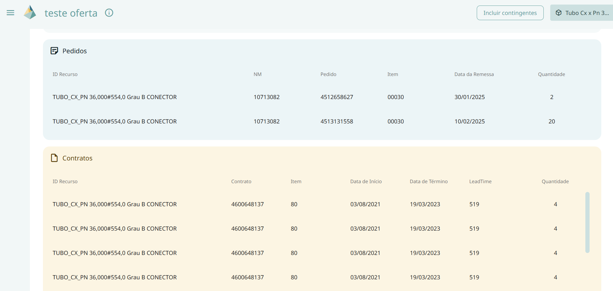

# Painel de Materiais

Este painel permite visualizar a **Demanda e Oferta** de um ou mais materiais.  

O objetivo deste painel é proporcionar mais clareza e transparência na análise do **atendimento de materiais**. 

Nesta interface, são exibidas as seções de **Demanda** e **Oferta**, com as seguintes informações:  

## Demanda
Exibe a lista de atividades que demandam o recurso. As informações incluem:  
- PG

- Tipo de Tarefa

- Sonda

- Código do Recurso

- Atividade

- Data de Necessidade – data de início da atividade  

- Quantidade Demandada

- Contingente 

- Status da Atividade – *(listar opções aqui)*  

Nota: Não são exibidas tarefas que já ocorreram (no passado).  

## Oferta
Exibe a lista de **ofertas** dos materiais. As informações incluem:  

### Estoque
- Código do Recurso
- NM
- Centro
- Tipo Avaliação
- Depósito
- Quantidade

### Pedido
- Código do Recurso
- NM
- Pedido
- Item
- Data da Remessa
- Quantidade

### Contrato
- Código do Recurso
- Contrato
- Item
- Data de Início
- Data de Término
- LeadTime
- Quantidade

## Funcionalidades

### Incluir Contingentes
Permite visualizar a tabela com as atividades e recursos contingentes. *(Confirmar se a exibição é para atividades ou recursos.)*  

### Selecionar Recurso
Permite alterar os materiais que estão sendo visualizados. 

