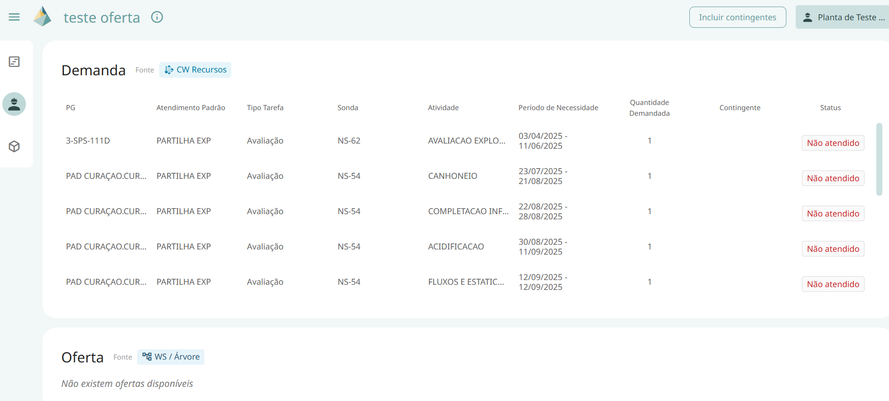

# Painel de Serviços

Este painel permite visualizar a **Demanda e Oferta** de um serviço.  

O objetivo deste painel é proporcionar mais clareza e transparência na análise do **atendimento de serviços**.  

Nesta interface, são exibidas as seções de **Demanda** e **Oferta**, com as seguintes informações:  

## Demanda
Exibe a lista de atividades que demandam o recurso. As informações incluem:  

- PG

- Atendimento Padrão 

- Tipo de Tarefa

- Sonda

- Atividade

- Período de Necessidade – data de início e fim da atividade  

- Quantidade Demandada

- Contingente 

- Status da Atividade – *(listar opções aqui)*  

Nota: Não são exibidas tarefas que já ocorreram (no passado).  

## Oferta

Exibe a lista de **disponibilidade** dos serviços. As informações incluem:  

- Data de Início

- Data de Fim

- Atendimento Padrão

- Quantidade Disponível

## Funcionalidades

### Incluir Contingentes

Permite visualizar a tabela com as atividades e recursos contingentes. *(Confirmar se a exibição é para atividades ou recursos.)*  

### Selecionar Recurso

Permite alterar o serviço que está sendo visualizado.  

