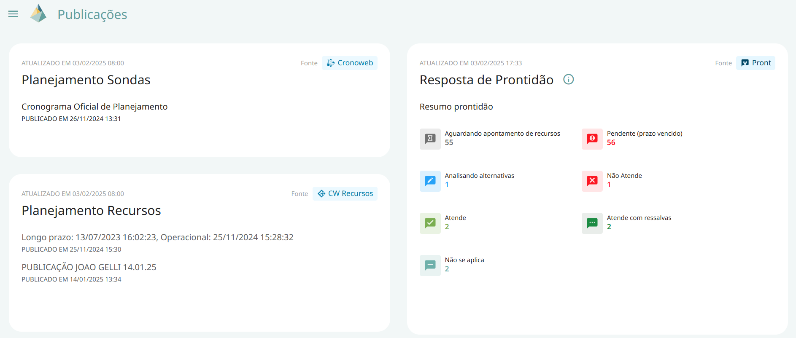

# Painel de Publicações

Este painel permite ao usuário visualizar as informações mais recentes das fontes de dados conectadas ao PRISMA.  

- Planejamento de Sondas: exibe o último cronograma publicado.  

- Planejamento de Recursos: apresenta a última publicação de escopo disponível.  

- Resposta de Prontidão: fornece um resumo em tempo real das quantidades de tarefas por resposta de prontidão no PRONT.  

