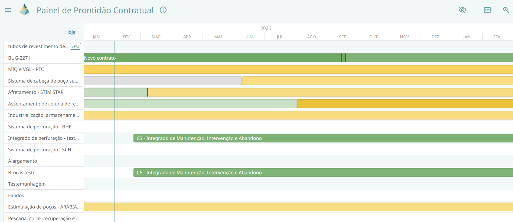

---
tags:
  - CROSS
---
# Visão Contratual

Este painel permite a visualização do **Acompanhamento Contratual de Bens e Serviços** realizado no CROSS.  

Nesta interface, é exibido um cronograma em formato Gantt, no qual são representadas as **Linhas de Acompanhamento Contratual (LAC)** e os **Grupos de Atendimento Contratual (GAC)**, juntamente com seus respectivos atendimentos.  

## Funcionalidades

### Zoom

Permite ajustar a quantidade de períodos exibidos na linha do tempo.

- Reduzindo o zoom: amplia o horizonte temporal, exibindo mais anos.  

- Aumentando o zoom: detalha períodos menores, focando em um ano específico.  

### Ocultar do painel
Personaliza a exibição dos atendimentos no gráfico Gantt.  

O usuário pode optar por ocultar:  

- Contratos vigentes de bens  

- Contratos vigentes de serviços  

- Ambos  

### Legenda
Disponibiliza um recurso visual que facilita a interpretação do código de cores utilizado no gráfico Gantt.  

