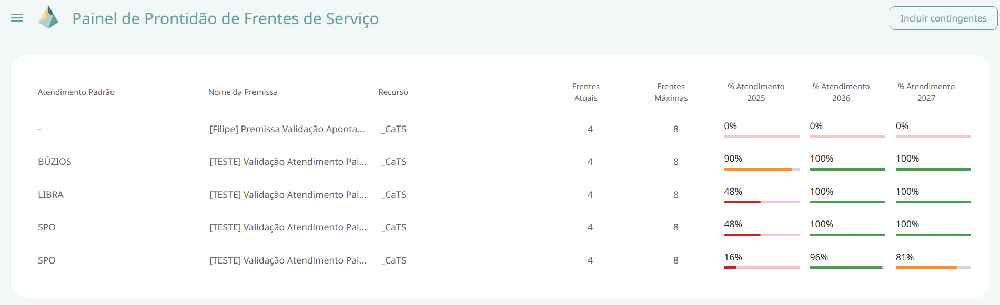

---
tags:
  - DELFOS
  - ÁRVORE DE RECURSOS
---
# Visão Médio Prazo

Este painel permite a visualização do **Acompanhamento do Atendimento de Frentes de Serviços**, considerando a demanda diária determinística calculada pelo DELFOS.   

Nesta interface, é exibida uma tabela contendo as seguintes informações:  

- Atendimento Padrão da Premissa *(exibir logotipo do DELFOS)*  

- Nome da Premissa *(exibir logotipo do DELFOS)*  

- Recurso  *(exibir logotipo do DELFOS)*  

- Frentes Atuais *(exibir logotipo da Árvore de Recursos)* – quantidade de serviços atualmente disponíveis para atendimento. 

- Frentes Máximas *(exibir logotipo da Árvore de Recursos)* – quantidade máxima de serviços disponíveis em contrato.  

- Percentual de Atendimento (Ano Corrente + 2 Anos) *(exibir logotipo do DELFOS)* – incluir a descrição do tooltip correspondente. 

- Percentual de Capacidade (Ano Corrente + 2 Anos) *(exibir logotipo do DELFOS)* – incluir a descrição do tooltip correspondente.  

## Funcionalidades

### Incluir Contingentes  
Permite visualizar a tabela com os recursos contingentes.  

